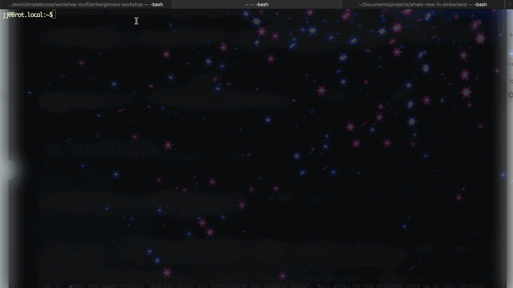

# An Intro to Ember

## What is Ember?

Ember or more specifically EmberJS (JS stands for **J**ava**S**cript) is a framework that helps you build entire websites using JavaScript. Many modern websites are built based on JavaScript frameworks like EmberJS alone. JavaScript websites or so-called **web applications** tend to feel faster for their users and follow many best practices (TODO: dunno about the phrasing though) to create websites today.

The entire Ember framework is written in JavaScript and you can use JavaScript to build your web applications with Ember, too. Ember helps you to manage JavaScript files, allows you to edit them and run them in the browser. To achieve this, Ember will generate new JavaScript files for you on command, that you can modify further in your text editor to build your app.

The app we'll building today will in the end look something like this:

In this section we'll learn some of the basic principles of Ember and how we can use an important tool - the Ember CLI (CLI stands for **C**ommand **L**ine **I** nterface) - to make building our application really easy.

<!--  Ember Tutorial: Super Rentals

- What is Ember? A JavaScript framework
- Overview of Finished Super Rentals app.
- Exercise: Generate an app. Ember new. Investigate dir structure.
- Exercise: Run the app. Learn about localhost and how to view the app. -->

## Generate a new app project

In the following section you will learn about the [Ember CLI](https://cli.emberjs.com/release/). You will learn how to use it to
- create a new app project to get started with your application
- serve an EmberJS application from your own computer and see it running in your browser

### Exercise: Generate an application

- Prerequisites: This step requires the Ember CLI to already be installed on your computer. You can check if it's installed by typing into your terminal: `ember -v`. If you see `ember: Command not found`, it means that Ember CLI is not installed on your computer. Please review the [installation instructions from the pre-installation step](#TODO: INSERT LINK TO PREINSTALL PARTY GUIDELINES)
- Open your terminal
- Type in `cd ~/Desktop/emberginners-workshop` and hit enter to put yourself into the correct folder to create your app in
- Type in `ember new super-rentals` and hit enter and investigate the console output. Wait until no new messages show up in your terminal

