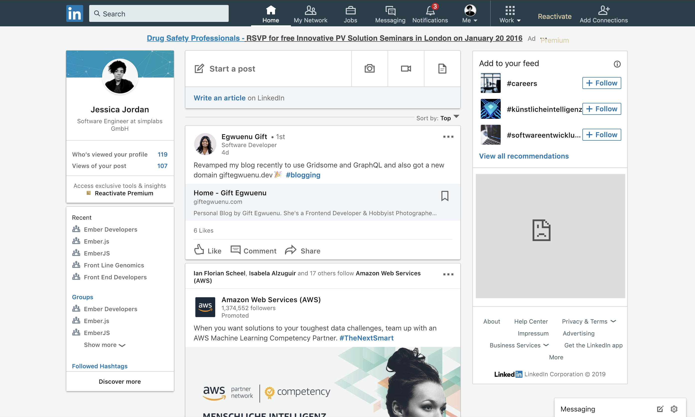

# Pre-Install Party

## Welcome!

This is a workshop to teach those who have never programmed (or at least never programmed with JavaScript - the programming language of the web) before a few basics in web and JavaScript development. This also includes a short introduction into the JavaScript framework EmberJS which we will use to build our very first web application.

## How to follow the workshop

This workshop and its materials are based on the workshop slides that you can find online at [#url-here](#url-here).
You can follow the slides and go back to previous lessons any time before, during or after the workshop.

Do you have feedback or improvements for the workshop materials? Talk to us during the workshop and we'd be looking forward to incorporate your suggestion into the next edition of this project.

## What does web development mean?

Learning more about web development allows you to build your own websites and web apps that you can publish online and share with the world! If you ever had the idea for a new project or a tool that can be used online, then this workshop is just for you.

As someone who builds websites and web apps, you're using different technologies or so-called **programming languages**. The main languages used on the web are **HTML**, **CSS** and **JavaScript**. In the scope of this course we will focus on JavaScript, but if you have interest in learning more about HTML and CSS, we'd like to encourage you to follow your interest. We can also share more materials on these technologies for further learning at the end of the workshop.

With JavaScript as one of the main languages of the web, we can - once we know how to read and write JavaScript code - build our own, interactive web experiences. Many websites nowadays heavily depend on JavaScript to run. These websites which are mainly based on JavaScript programs are also called **single-page applications**. Examples for popular single-page applications online are [gmail.com](https://gmail.com), [Twitter](https://twitter.com), [Linkedin](https://linkedin.com) or [Instagram](https://instagram.com). Building single-page applications allows us to build modern websites, which feel faster and are more responsive than the traditional websites we are used to from the 90s.

## What is Ember?

Ember is a specific **JavaScript framework** that allows us to build fast single-page applications. As a framework it provides us with a way to write JavaScript code to create our app, but it also provides us with many useful tools to do so. We will learn more about what these tools are about at the workshop.

If you're curious about what you can build with Ember, check out a few of the following websites that are built using it:

- Showcase 1: [Linkedin.com](https://www.linkedin.com/)

- Showcase 2: [Heroku Dashboard](https://dashboard.heroku.com/)

- Showcase 3: [Playstation Store](https://store.playstation.com/de-de/home/games)

## How does this workshop work?

This workshop is about learning something new that helps you to explore new interests and provide basic knowledge to continue learning.
What's important in that regard?

- Keep an open mind
- Be patient
- Help each other out
- Ask the mentors questions!
- Celebrate your successes today

Feel free to pair with one or two other people in the group. If you prefer working on your own, this is also great - see whatever works best for you!

## Getting setup

To be able to follow the workshop, we need to install several programs onto our computer and get familiar with a few.

### Installation (Part 1)

#### Installing a text editor

To be able to write our first web application we need to install a text editor to be able to edit our program. In the scope for this workshop we will use **Atom** which is a free text editor that's well suited for development, too. You can download and install it over [here](https://atom.io/).

#### Installing a browser

Several browsers provide us with tools that help us to develop our web application. In the scope of this workshop we'd like to use **Google Chrome**. If you haven't got it on your computer yet, you can download and install it over [here](https://www.google.com/chrome/).

### Getting familiar with the terminal

<!-- TODO: Add full instructions for folder navigation, copy+pasting commands, stopping running tasks -->
— What do you use the terminal for? Which terminologies are there for the terminal?
— How do you open / close / stop a terminal?
— How do you copy-paste commands?
— What does the output mean? → Demo

#### Exercise: Navigate across directories

- Exercise: Create and Change Directories
- ? Figure out, if there are admin permissions to figure out for Windows users

### Installation (Part 2)

- Exercise: Getting to know the terminal (Windows, Mac, Linux)
- Exercise: Install Git
- Exercise: Install Node
- Exercise: Install Ember CLI
- Reference: https://guides.emberjs.com/release/getting-started/
